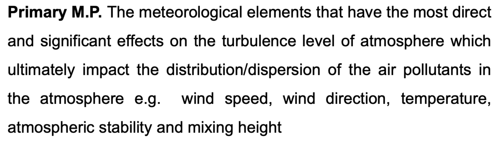

# Mini-Project-Image-to-Text-to-Audio

This project is a Python script that performs optical character recognition (OCR) on an image and converts the extracted text into speech using Google Text to Speech (gTTS).

## Project Description 

The purpose of this project is to demonstrate how to use Python libraries to extract text from an image using OCR techniques and convert the extracted text into speech. The project utilizes the following libraries:

- pytesseract: An OCR tool for Python that extracts text from images.
- Pillow: A Python imaging library used to open and process the image.
- gTTS: A Python library that converts text to speech using the Google Text to Speech API.

---

To run this project :

- Install Tesseract OCR system packages and the required Python libraries

- Upload the image file you want to perform OCR on. In the code, the image file is expected to be located at /content/image.png.

- Open the Jupyter Notebook file and execute the code cells. The extracted text will be printed, and an audio file (audio.mp3) will be generated with the speech output.

---

The image used in this sample is :

